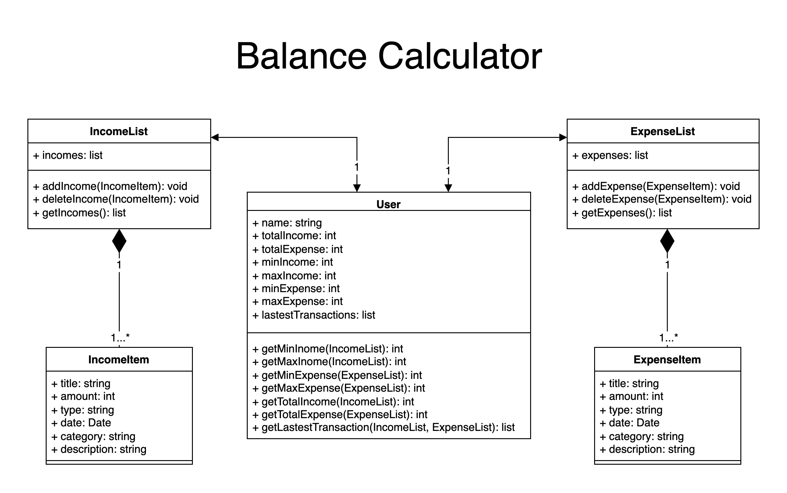

# Balance Calculator
## Team Members
* Zhiqing Su         su.zhiq@northeastern.edu
* Xinyue Zhang	     zhang.xinyue12@northeastern.edu
* Dongsheng Cheng	   cheng.do@northeastern.edu	
* Zongyao Li	       li.zongyao@northeastern.edu

## Description
Our project is a balance calculator. Users can view income and expense details, total value and balance, and add or delete an income or expense. Each detail contains information such as time, category, description, etc., which can help users better manage income and expenditure records.
## User Story
1. As a user, I want to be able to view my total income, expense and balance.
2. As a user, I want to be able to view my latest income and expense records on the dashboard.
3. As a user, I want to be able to view my income and expense range.
4. As a user, I want to be able to add an income or expense statement including title, amount, date, and description.
5. As a user, I want to be able to delete an income or expense statement.

## Story Assignment 	

### Zhiqing Su

### Xinyue Zhang

### Dongsheng Cheng	

### Zongyao Li

## Milestones
1. Milestone 1: Calculator dashboard
- Total income, expense and balance
- Latest transactions
- Income and expense range

2. Milestone 2: Income
- Add a new income statement
- Delete an income statement

3. Milestone 3: Expense
- Add a new expense statement
- Delete an expense statement

4. Milestone 4: Google Map Api
- Add Google Map Api to locate the place of consumption and income

## Object Model

## OpenAPI Specification
We will create an OpenAPI Specification Yaml file that includes the description, request method, request body, response format, error response format, and any required schemas for each of the REST API resources listed above. The spec will also include examples of parameters and object properties.
