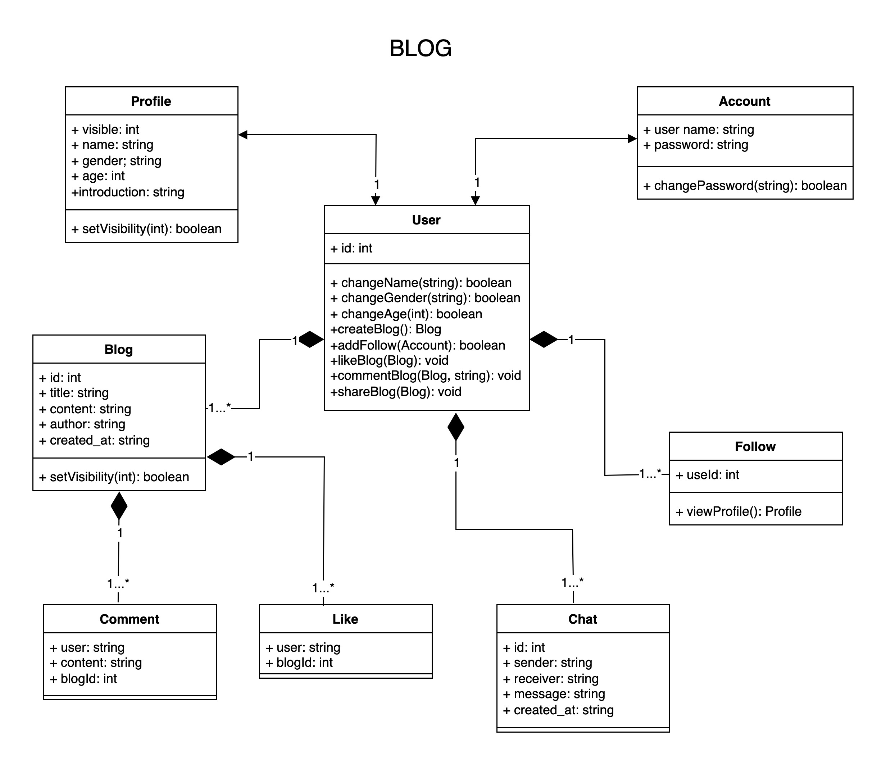

# BLOG
## Team Members
* Zhiqing Su         su.zhiq@northeastern.edu
* Xinyue Zhang	     zhang.xinyue12@northeastern.edu
* Dongsheng Cheng	   cheng.do@northeastern.edu	
* Zongyao Li	       li.zongyao@northeastern.edu

## Description
Our project is a web-based application that allows users to create their own blogs and share their posts with the world. The application has a social media component, allowing users to follow other bloggers and see their posts in their feed. Users can also like, comment, and share posts with their followers. The application has a search feature that allows users to search for other bloggers or posts based on keywords. The application also allows people to use the chat function to send private messages to other users.
## User Story
1. As a user, I want to create an account and change the password via email, so that I can share my posts with others.
2. As a user, I want to fill in and modify personal information, including name, gender, age, and introduction, so that people can understand me better.
3. As a user, I want to be able to create a blog, so that I can share my thoughts and ideas with others.
4. As a user, I want to be able to follow other bloggers, so that I can see their posts in my feed.
5. As a user, I want to be able to like posts, so that I can show my appreciation for a post.
6. As a user, I want to be able to comment on posts, so that I can share my thoughts and engage with the blogger.
7. As a user, I want to be able to share posts, so that I can share interesting posts with my followers.
8. As a user, I want to be able to search for other bloggers or posts based on keywords, so that I can discover new content.
9. As a user, I want to be able to edit or delete my posts, so that I can manage my blog.
10. As a user, I should be able to set whether my profile and posts are public or not.
11. As a user, I want to be able to chat privately with other users, so that I can communicate more easily.

## Milestones
1. Milestone 1: User profile and blog creation
- User profile creation
- Blog creation
 (Assigned to Zhiqing Su)
2. Milestone 2: Social media features
- Follow other bloggers
- Like and comment on posts
- Share posts
 (Assigned to Xinyue Zhang)
3. Milestone 3: Search feature and post management
- Search for bloggers and posts
- Edit or delete posts
 (Assigned to Dongsheng Cheng)
4. Milestone 4: Chat
- Send private messages
 (Assigned to Zongyao Li)

## Object Model

## OpenAPI Specification
We will create an OpenAPI Specification Yaml file that includes the description, request method, request body, response format, error response format, and any required schemas for each of the REST API resources listed above. The spec will also include examples of parameters and object properties.
